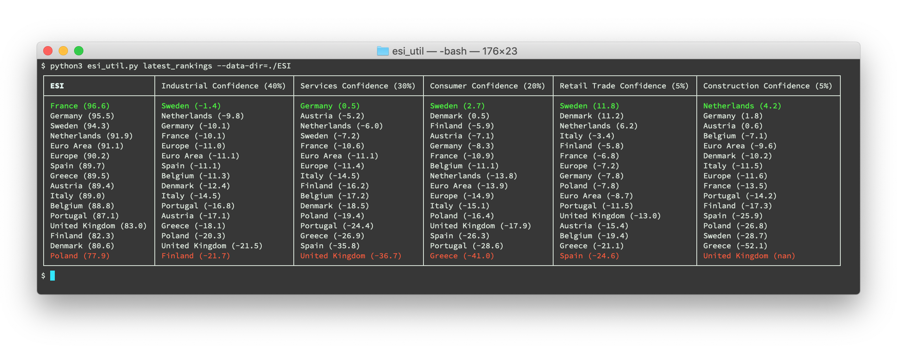

# European Economic Sentiment Indicator (ESI) Utility

`esi_util.py` is a Python script that displays a ranking of countries (as well as the EU and the Euro Area) based on the latest [ESI (Economic Sentiment Indicator)](https://ec.europa.eu/eurostat/statistics-explained/index.php/Glossary:Economic_sentiment_indicator_(ESI)) data. It also renders a series of interactive SVG charts based on historical ESI data.




## Usage

### First Steps 
1. Download the zip file [main\_indicators\_sa\_nace2.zip](https://ec.europa.eu/economy_finance/db_indicators/surveys/documents/series/nace2_ecfin_2009/main_indicators_sa_nace2.zip) which contains `main_indicators_nace2.xlsx`.
2. **Important:** Make sure you have `main_indicators_nace2.xlsx` (which contains all the ESI data) present in the directory where you will run the script, or pass the `--data-dir` argument to the script with a path to a directory that contains the file. For example, if you have `main_indicators_nace2.xlsx` in a subdirectory called `ESI/` you would run the following command to see the latest ESI rankings: `python esi_util.py latest_rankings --data-dir=./ESI`
3. Make sure you have all the script dependencies installed (see [requirements.txt](/requirements.txt)). You can install the dependencies by running `pip install -r requirements.txt`. Consider using a virtual environment such as [venv](https://docs.python.org/3/library/venv.html).
4. You can always see the available script commands by running: `python esi_util.py --help`.

Python >= 3.6 is supported.

### Available Commands

Below is a list of available commands:

- [Latest ESI Rankings](#latest-esi-rankings)
- [Industrial Confidence Chart](#industrial-confidence-chart)
- [Services Confidence Chart](#services-confidence-chart)
- [Consumer Confidence Chart](#consumer-confidence-chart)
- [Retail Trade Confidence Chart](#retail-trade-confidence-chart)
- [Construction Confidence Chart](#construction-confidence-chart)
- [ESI Chart](#esi-chart)

Please note that all commands accept the following optional arguments:

- `--data-dir` lets you specify a path where the xlsx file with the ESI data is. By default it is assumed to be the current directory (where the script runs). Example: `--data-dir=./ESI`.
- `--esi-filename` lets you specify the exact filename of the xlsx file with the ESI data. The default name is `main_indicators_nace2.xlsx`. Example: `--esi-filename=esi.xlsx`
- `--esi-sheet-name` lets you specify the xlsx sheet name that contains the ESI data. The default is 'MONTHLY'. Example: `--esi-sheet-name='ESI MONTHLY'`.

#### Latest ESI Rankings

This command gives you a ranking of all countries/entities for each ESI component and the ESI composite itself, based on the latest ESI data. 

```bash
$ python3 esi_util.py latest_rankings
```

With the `--json-output` switch it outputs the same rankings as JSON, i.e., `python3 esi_util.py latest_rankings --data-dir=./ESI --json-output`.

### Industrial Confidence Chart

Render an SVG chart with the ESI Industrial Confidence data for the past 12 months (this is the default window of time). The filename of the chart is specified by `--filename` and it is saved in the directory where the script runs. (If you don't specify a filename the actual SVG source is printed in the console.)

```bash
$ python3 esi_util.py industrial_chart --filename=industrial_esi.svg
```

To cover a longer period of time use the `--months` parameter. For example, passing `--months=36` will render a chart for the past 3 years.

#### Services Confidence Chart

Render an SVG chart with the ESI Services Confidence data for the past 12 months. Use the `--months` parameter for a longer period of time.

```bash
$ python3 esi_util.py services_chart --filename=services_esi.svg
```

#### Consumer Confidence Chart

Render an SVG chart with the ESI Consumer Confidence data for the past 12 months. Use the `--months` parameter for a longer period of time.

```bash
$ python3 esi_util.py consumer_chart --filename=consumer_esi.svg
```

#### Retail Trade Confidence Chart

Render an SVG chart with the ESI Retail Trade Confidence data for the past 12 months. Use the `--months` parameter for a longer period of time.

```bash
$ python3 esi_util.py retail_trade_chart --filename=retail_trade_esi.svg
```

#### Construction Confidence Chart

Render an SVG chart with the ESI Retail Trade Confidence data for the past 12 months. Use the `--months` parameter for a longer period of time.

```bash
$ python3 esi_util.py construction_chart --filename=construction_esi.svg
```

#### ESI Rankings Chart

Render an SVG chart for the overall ESI for the past 12 months. Use the `--months` parameter for a longer period of time.

```bash
$ python3 esi_util.py esi_chart --filename=esi.svg 
```

## License

`esi_util.py` is released under the [MIT License](LICENSE).
